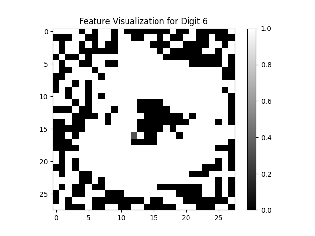

# DNN - MILP
This is an attempt to implement the research paper by Matteo Fischetti & Jason Jo on DNN-MILP.
Hopefully, this implementation will encourage further research in the area of MILP-DNN.
https://arxiv.org/abs/1712.06174
##### todo improve readme
## Output from Feature_viz.py
Result - Optimal solution found

Objective value: &emsp;&emsp;&emsp;&emsp;&nbsp;        2116.15962907  
Enumerated nodes: &emsp;&emsp;&nbsp;&nbsp;             503 
Total iterations:&emsp;&emsp;&emsp;&emsp; &nbsp;&nbsp;        10873 
Time (CPU seconds):&emsp;&emsp;&nbsp;          5.03 
Time (Wallclock seconds):&nbsp;     5.03 

Option for printingOptions changed from normal to all 
Total time (CPU seconds):       5.04    
(Wallclock seconds):       5.04 
